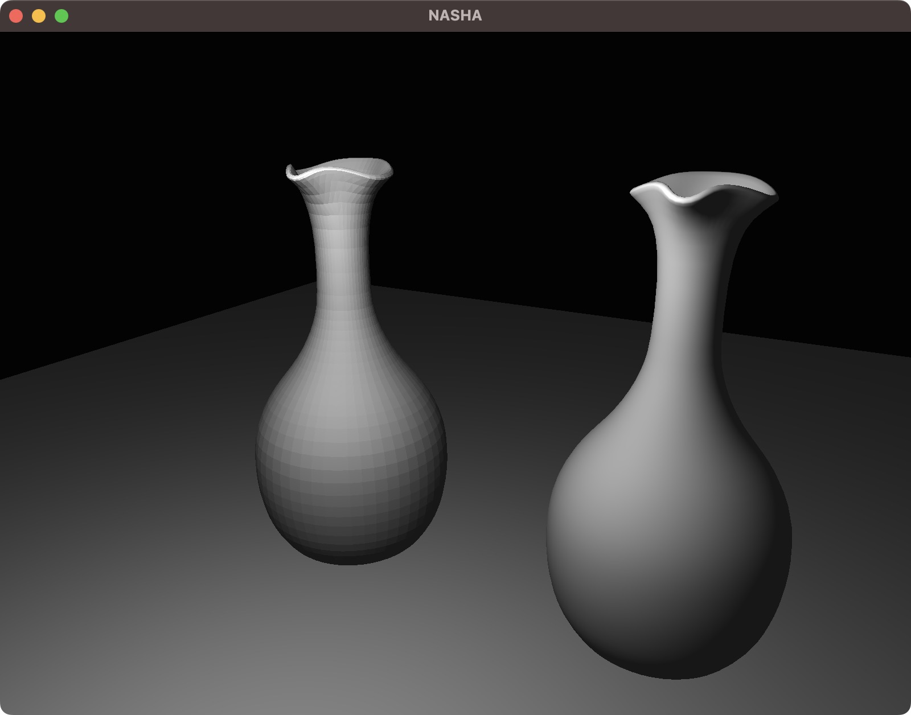
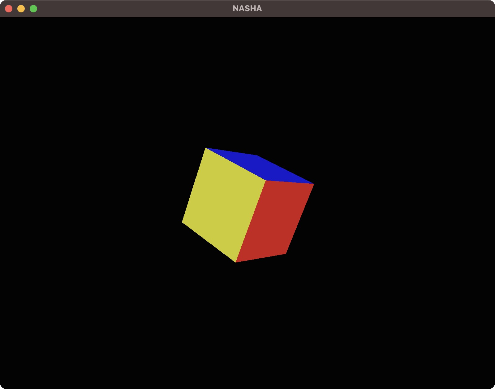

# NaSha-Engine (Vulkan)
This is a vulkan based engine in progress... <br><br>
**Problem(for now):**  You have to compile the glsl shaders for your own machine manually located at `Nasha/src/Nasha/shaders` before running the program<br><br>
**Just** clone the project and **run:**
```
mkdir build-dir
cd build-dir
cmake ..
make
```
<br><br>
**Current Progress**(All images available at dir /Sandbox/progress)


